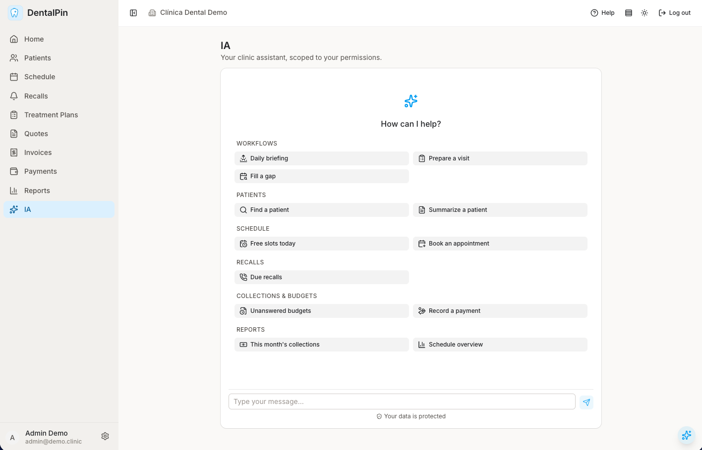
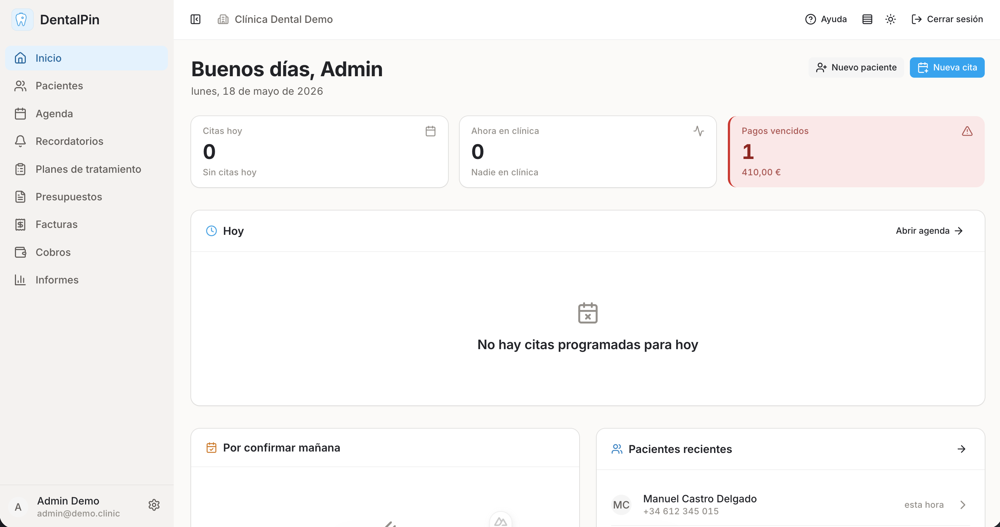
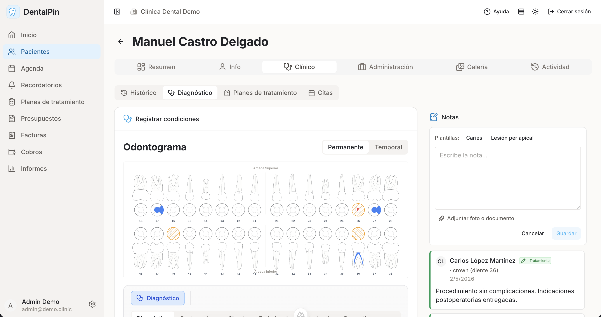
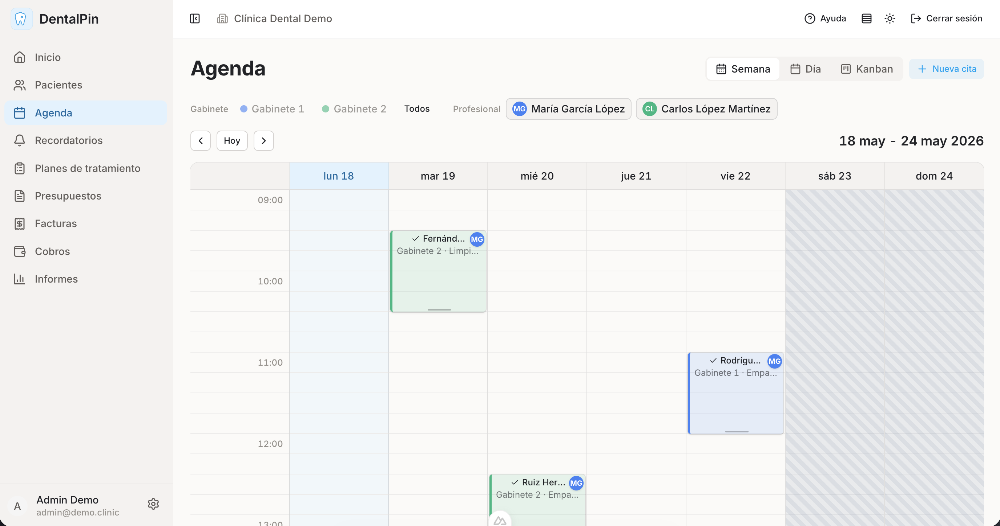
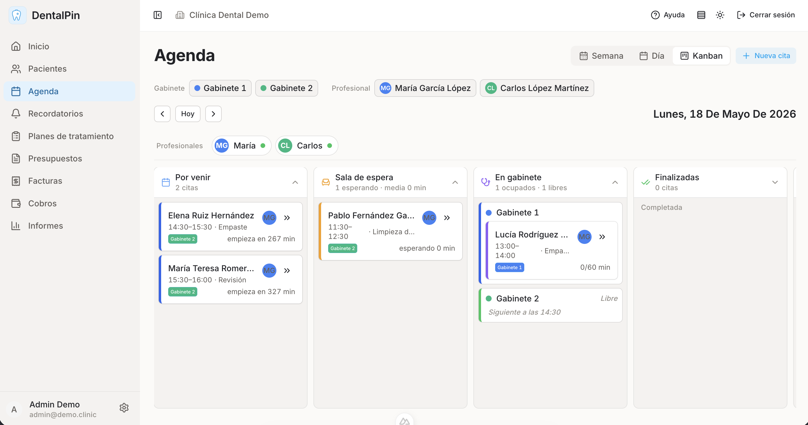
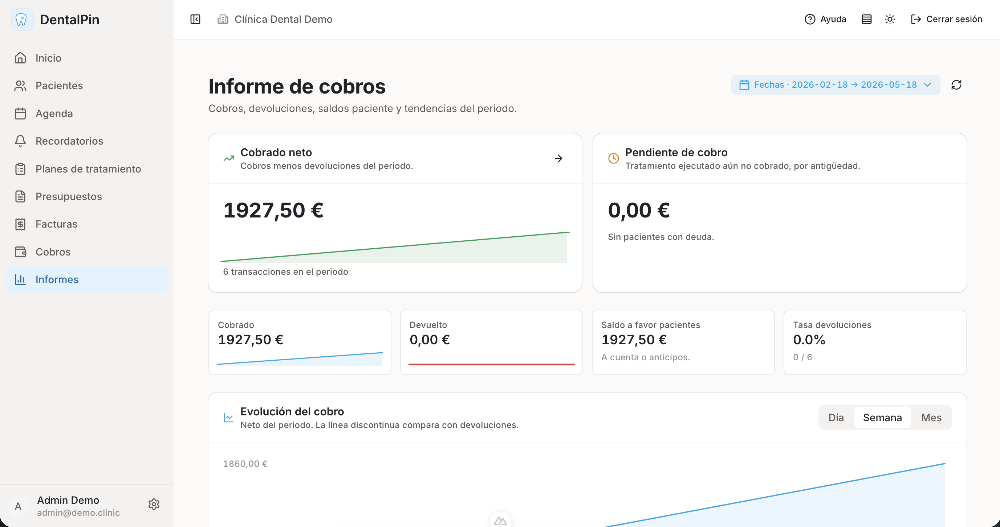
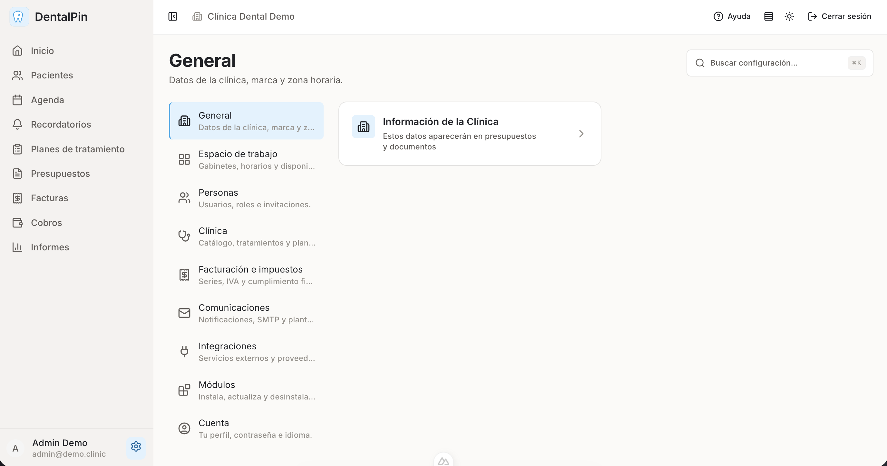

# DentalPin
test
Open source dental clinic management software. Built with modular architecture for extensibility.

## Why DentalPin?

Dental clinics around the world share the same fundamental needs: managing patients, scheduling appointments, tracking treatments, and running their practice efficiently. Yet the software landscape is fragmented into dozens of localized, closed-source solutions that lock clinics into expensive contracts and outdated technology.

**We believe it's time for a change.**

DentalPin is built on a simple premise: **one open platform for dental clinics everywhere**. Not another regional solution, but a global foundation that any clinic can adopt, any developer can extend, and any community can localize.

### Why now?

AI has fundamentally changed what small teams can build. Features that once required large development departments can now be implemented in days. This is our window to create the open source dental software that should have existed years ago—before clinics got locked into legacy systems they can't escape.

### Our principles

- **Open Source** — Your clinic data belongs to you. Your software should too.
- **Modular** — Start simple, add what you need. Don't pay for features you'll never use.
- **Global by Design** — Built for localization from day one. Same core, any language, any country.
- **API-First** — Every feature is an API. Integrate with anything, automate everything.
- **AI-Ready** — Structured for the AI era. Ready for intelligent scheduling, clinical decision support, and workflow automation.

### The vision

We're not just building software—we're building the foundation for an ecosystem. A platform where developers contribute modules, clinics share improvements, and the entire dental community benefits from collective innovation.

Clinics deserve better than closed, expensive software from the last decade. DentalPin is the open alternative.

## ✨ AI Copilot

DentalPin ships with a built-in **agentic AI assistant** that turns the whole clinic into something you can simply talk to. Ask it to find a patient, free up a slot, chase an unanswered budget, or brief you on the day ahead — in plain Spanish or English — and it acts on your real data.



This isn't a chatbot bolted on top. The Copilot is a true agent that **plans and executes multi-step tasks** by calling the same operations the UI does, across patients, schedule, recalls, budgets, payments, and reports.

- **It does, not just answers.** The agent runs real tools — search patients, book or reschedule appointments, record a payment, pull this month's collections — and chains them to complete a task end to end.
- **It can never overstep your role.** Every tool call is re-checked against the calling user's RBAC permissions at the execution chokepoint. The Copilot can see and do *exactly* what that user could do through the UI — nothing more, scoped to their clinic.
- **Your data is protected.** PHI is redacted before anything leaves for the LLM provider: patient names, phones, emails, and IDs are swapped for deterministic tokens, and free-text clinical tools are excluded from the cloud path entirely. Redaction is on by default.
- **Writes ask first.** Any action that changes data (booking, payments, edits) pauses mid-conversation for your explicit confirmation before it runs.
- **Guided workflows.** Ready-made playbooks — *Daily briefing*, *Prepare a visit*, *Fill a gap*, *Due recalls*, *Unanswered budgets* — kick off common multi-step jobs in one tap.
- **Proactive briefings.** Opt in to a deterministic morning digest emailed to your team, summarizing the day's schedule, due recalls, and open budgets — no LLM, no PHI off-site.
- **Modular by design.** The Copilot consumes tools published by each module through a shared registry; every module contributes its own capabilities, so the agent grows automatically as new modules are installed.

Vendor-agnostic under the hood (an LLM-provider abstraction), with provider, model, and per-clinic token budgets configurable per deployment. Architecture: [docs/technical/copilot-agentic-architecture.md](docs/technical/copilot-agentic-architecture.md).

## Website

Visit [**dentalpin.com**](https://www.dentalpin.com) for product info, features, and commercial details.

## Screenshots

### AI Copilot


### Dashboard


### Patient Management


### Weekly Schedule


### Kanban Schedule


### Payments Chart


### Settings


## Quick Start

```bash
# Start services
docker-compose up -d

# Seed demo data (English by default)
./scripts/seed-demo.sh

# Or seed in Spanish
./scripts/seed-demo.sh --lang es
```

Open http://localhost:3000

### Demo Credentials

All users have password: `demo1234`

| Email | Role | Name (EN) | Name (ES) |
|-------|------|-----------|-----------|
| admin@demo.clinic | admin | Admin Demo | Admin Demo |
| dentist@demo.clinic | dentist | Dr. Sarah Johnson | Dra. María García López |
| hygienist@demo.clinic | hygienist | Michael Williams | Carlos López Martínez |
| assistant@demo.clinic | assistant | Emily Davis | Ana Martínez Ruiz |
| receptionist@demo.clinic | receptionist | Jessica Brown | Laura Sánchez Pérez |

See [docs/user-manual/demo.md](docs/user-manual/demo.md) for full details on demo data.

## Tech Stack

| Layer | Technology |
|-------|-----------|
| Backend | FastAPI (Python 3.11+) |
| Frontend | Nuxt 3 + Nuxt UI |
| Database | PostgreSQL 15 |
| Auth | JWT with refresh tokens |

## Features

### AI Copilot
- **Agentic Assistant** — Conversational agent that plans and executes multi-step tasks across patients, schedule, recalls, budgets, payments, and reports by calling real operations
- **RBAC Parity** — Every action re-checked against the user's permissions; the agent can only do what that user could through the UI, scoped to their clinic
- **PHI Redaction** — Patient identifiers tokenized before reaching the LLM; free-text clinical data stays off the cloud path. On by default
- **Confirmed Writes** — Data-changing actions pause for explicit user confirmation mid-conversation
- **Workflows & Digest** — One-tap playbooks (daily briefing, prepare a visit, fill a gap) plus an opt-in proactive morning email digest
- **Bilingual & Vendor-Agnostic** — Works in Spanish and English; configurable LLM provider, model, and per-clinic token budget

### Clinical Management
- **Patient Records** — Complete patient profiles with personal data, contact info, medical history, and notes
- **Dental Chart (Odontogram)** — Interactive tooth diagram with treatment tracking per tooth/surface
- **Appointment Calendar** — Weekly and daily views with drag & drop, professional columns, conflict detection
- **Treatment Catalog** — Customizable catalog with codes, prices, VAT types, and categories

### Financial Management
- **Budgets/Estimates** — Create treatment budgets, track approval workflow (draft → pending → approved/rejected), patient signature capture, PDF generation
- **Invoices** — Generate invoices from budgets or standalone, automatic numbering, multiple payment methods, PDF export
- **Payments** — Track partial payments, payment history, balance calculation

### Practice Management
- **Role-based Access Control** — Five roles (admin, dentist, hygienist, assistant, receptionist) with granular permissions
- **Cabinet/Room Management** — Define treatment rooms with schedules and colors
- **Professional Management** — Assign appointments to specific dentists/hygienists

### User Experience
- **Visual Selectors** — Smart dropdowns showing recent patients and popular treatments
- **Bilingual Interface** — Full Spanish and English localization
- **Dark Mode** — System-aware theme switching
- **Responsive Design** — Works on desktop and tablet

### Technical Features
- **Modular Architecture** — Plugin-based system for easy extensibility
- **Event Bus** — Inter-module communication for notifications and integrations
- **REST API** — Complete API with OpenAPI documentation
- **Real-time Updates** — Reactive UI with optimistic updates

## Development

### Prerequisites

- Docker and Docker Compose
- Python 3.11+ (for local backend development)
- Node.js 18+ (for local frontend development)

### Running locally

```bash
# Start all services
docker-compose up

# Or run backend separately
cd backend
pip install -e ".[dev]"
uvicorn app.main:app --reload

# Or run frontend separately
cd frontend
npm install
npm run dev
```

### Database Management

```bash
# Reset database and run migrations
./scripts/reset-db.sh

# Seed demo data (English - default)
./scripts/seed-demo.sh

# Seed demo data (Spanish)
./scripts/seed-demo.sh --lang es

# Full setup (reset + seed in one command)
./scripts/setup-demo.sh
```

### Running tests

```bash
# Backend unit + integration (in Docker)
docker-compose exec backend python -m pytest -v

# Slow Alembic round-trip (opt-in, see docs/technical/creating-modules.md)
docker-compose exec backend python -m pytest -v -m alembic_roundtrip

# Frontend unit (vitest)
cd frontend
npm run test
```

**Browser E2E (Playwright)** lives in `frontend/tests/e2e/` and drives
the full stack at `localhost:3000` → `:8000`. Runs on the host because
the Alpine frontend container can't launch Chromium.

```bash
# One-time setup
(cd frontend && npm install && npx playwright install chromium)

# Make sure the stack is up + seeded first
docker-compose up -d
./scripts/seed-demo.sh

# Full E2E suite (nav + RBAC + patient detail smoke)
./scripts/e2e.sh

# Single file
./scripts/e2e.sh rbac

# Interactive UI
./scripts/e2e.sh --ui
```

Full runbook + fixture reference: [docs/technical/e2e-testing.md](docs/technical/e2e-testing.md).

## Architecture

DentalPin uses a modular plugin architecture. Each feature is a self-contained module that:
- Declares its SQLAlchemy models
- Provides a FastAPI router
- Can subscribe to events from other modules

See [docs/architecture.md](docs/architecture.md) for details.

## License

Business Source License 1.1 (BSL 1.1)

**Use Limitation:** You may not offer DentalPin as a commercial SaaS for dental clinic management.

**Change Date:** 4 years from release

**Change License:** Apache 2.0

See [LICENSE](LICENSE) for full terms.

## Contributing

See [CONTRIBUTING.md](CONTRIBUTING.md) for guidelines.

---

Backed by [Dentaltix](https://www.dentaltix.com)
# PureBite-Dental


