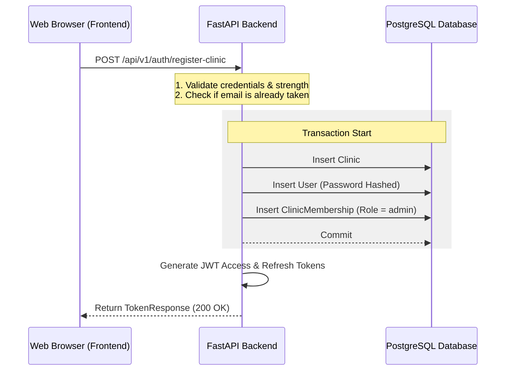

# Feature Specification: Clinic Self-Registration

This document outlines the design and implementation plan to support self-service clinic registration (tenant signup) in DentalPin.

---

## 1. Overview & Goals

Currently, DentalPin requires an administrator to provision new clinics and their first admin accounts using a backend command-line script (`scripts/create_tenant.py`). 

To make DentalPin self-service (either for SaaS deployments or multi-clinic hostings), we need a web interface and backend API that allows prospective clients to register their own clinics and immediately start using the application.

### Key Goals:
- Allow users to enter clinic details and admin account details in a unified frontend signup screen.
- Provision the clinic, administrator user account, and membership association in a atomic database transaction.
- Implement security gates (rate-limiting and configuration flags) to prevent public spam/abuse.

---

## 2. Technical Architecture



---

## 3. Backend Changes

### A. Environment Configuration (`backend/app/config.py`)
Add a new flag to allow administrators to enable or disable public self-registration:

```python
class Settings(BaseSettings):
    # ... other settings
    
    # Toggle to allow public clinic signup
    ALLOW_PUBLIC_CLINIC_REGISTRATION: bool = False
```

### B. Request Schema (`backend/app/core/auth/schemas.py`)
Define a new Pydantic schema for the self-registration payload:

```python
class ClinicRegister(BaseModel):
    """Schema for self-service clinic and admin registration."""
    # Clinic Details
    clinic_name: str = Field(min_length=2, max_length=100)
    tax_id: str = Field(min_length=5, max_length=20)
    
    # Admin User Details
    email: EmailStr
    password: str = Field(min_length=8)
    first_name: str = Field(min_length=1, max_length=100)
    last_name: str = Field(min_length=1, max_length=100)
```

### C. API Endpoint (`backend/app/core/auth/router.py`)
Create the registration endpoint:

```python
@router.post("/register-clinic", response_model=TokenResponse)
@limiter.limit("3/day")  # Strict rate limit to prevent spam
async def register_clinic(
    request: Request,
    data: ClinicRegister,
    db: Annotated[AsyncSession, Depends(get_db)],
) -> TokenResponse:
    """Register a new clinic and its first admin user."""
    # 1. Check if public registration is enabled
    if not settings.ALLOW_PUBLIC_CLINIC_REGISTRATION:
        raise HTTPException(
            status_code=status.HTTP_403_FORBIDDEN,
            detail="Public clinic registration is disabled on this server."
        )

    # 2. Validate password strength
    is_valid, error_msg = validate_password_strength(data.password)
    if not is_valid:
        raise HTTPException(
            status_code=status.HTTP_422_UNPROCESSABLE_ENTITY,
            detail=error_msg,
        )

    # 3. Check if email already exists
    result = await db.execute(select(User).where(User.email == data.email))
    if result.scalar_one_or_none():
        raise HTTPException(
            status_code=status.HTTP_409_CONFLICT,
            detail="Email address is already registered.",
        )

    # 4. Atomic database creation
    try:
        # Create the Clinic
        clinic = Clinic(
            id=uuid4(),
            name=data.clinic_name,
            tax_id=data.tax_id,
            timezone="Europe/Madrid",  # Default timezone
            currency="EUR",            # Default currency
            settings={
                "slot_duration_min": 15,
                "budget_expiry_days": 30,
                "budget_reminders_enabled": False,
            },
        )
        db.add(clinic)

        # Create the User
        user = User(
            id=uuid4(),
            email=data.email,
            password_hash=hash_password(data.password),
            first_name=data.first_name,
            last_name=data.last_name,
            is_active=True,
        )
        db.add(user)
        await db.flush()

        # Create the Membership as 'admin'
        membership = ClinicMembership(
            id=uuid4(),
            user_id=user.id,
            clinic_id=clinic.id,
            role="admin",
        )
        db.add(membership)
        await db.commit()
        
    except Exception as e:
        await db.rollback()
        raise HTTPException(
            status_code=status.HTTP_500_INTERNAL_SERVER_ERROR,
            detail="Could not register the clinic. Please try again.",
        )

    # 5. Generate and return authentication tokens
    access_token = create_access_token(user.id, token_version=user.token_version)
    refresh_token = create_refresh_token(user.id, token_version=user.token_version)

    return TokenResponse(
        access_token=access_token,
        refresh_token=refresh_token,
    )
```

---

## 4. Frontend Changes

### A. Navigation & Routing
- Add a new Nuxt page: `frontend/app/pages/register.vue`.
- Add a signup link in `frontend/app/pages/login.vue` below the form:
  ```vue
  <div class="text-center mt-4">
    <NuxtLink to="/register" class="text-caption text-primary hover:underline">
      ¿Quieres registrar tu clínica? Regístrate aquí
    </NuxtLink>
  </div>
  ```

### B. User Interface Layout (`frontend/app/pages/register.vue`)
- Implement a two-step wizard layout:
  1. **Step 1: Clinic Information** (Clinic Name, Tax ID / CIF).
  2. **Step 2: Administrator Information** (First Name, Last Name, Email, Password).
- Design system parity: Card layout, primary soft buttons, clear validation error boxes matching the login page theme.

---

## 5. Security & Protection Measures

1. **IP Rate Limiting**: The route is guarded with `slowapi` rate limiting set to `3/day` per IP address.
2. **Password Policy**: Enforces standard password rules (length, capitalization, numbers) using the existing `validate_password_strength` helper.
3. **Database Integrity**: The database write operations are wrapped in an explicit SQLAlchemy transaction block with error handling to rollback changes if one of the entities (Clinic, User, or Membership) fails to insert.
